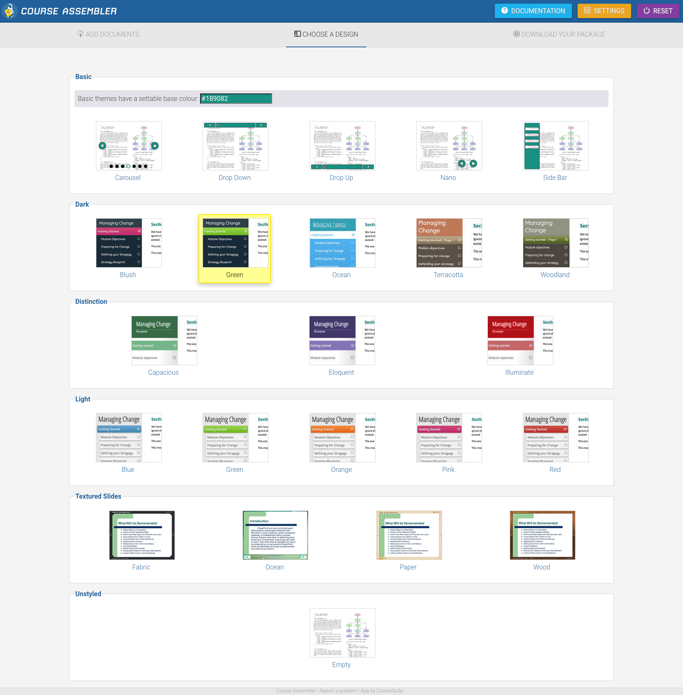

# courseassembler-templates
The source code for the templates used by Course Assembler.

This repository is the source code to the designs used by Course Assembler. You can download and modify the code if required.

If you use the [Coursesuite API](https://www.coursesuite.com) you can upload a zip package of a template to make it privately available through the design page programatically for your apikey. Any files other than the required files (see below) in the zip package will be persisted as-is when publishing.

## Creating your own themes

Pull requests or additional themes may be accepted and used (with credit).

Themes currently require 4 files which must be named properly. These files are all considered to be HandlebarsJS templates and will have specific token replaced during the publishing process:

* `_package.css` - contains all the styles including embedded resources (e.g. dataurls).
* `_package.js` - the main script runtime and all its required script libraries.
* `index.html` - the main HTML content
* `preview.jpg` - thumbnail for design tab screen (reccomended size 160 x 120px or larger)

### Available tokens

* `api` _string_ Compatibility setting; one of ["scorm12", "scorm2004", "imscp", "none"]
* `enough-count` _integer_ count of pages required to complete
* `navbg` _hex colour_ selected background colour, e.g. "#189082"
* `navlock` _boolean_ whether navigation is freeform or sequential
* `navtext` _rgb triplet_ foreground text colour, one of ["255,255,255", "0,0,0"]
* `option-course-copyright` _string_ "© Anonymous 2020. All rights reserved."
* `option-course-description` _string_ "This course was assembled at www.courseassembler.com"
* `option-course-name` _string_ "New features in CourseAssembler"
* `option-ga-id` _string_ Google analytics ID
* `pages` _array_ The pages used in the course, array of:
    * `audio` _string_ name of audio file for this page, if set, e.g. "d237ff96c68b03b9db61a7c818792dc5.mp3"
    * `content` _string_ renderer source for content, one of ["plugin", "h5p", "file", "media"]
    * `depth` _integer_ 0 for outdented, 1 for intented
    * `href` _string_ url to content relative to root of package "data/file-ka2ajdgo-0.html"
    * `index` _integer_ order the page appears, zero based
    * `score` _integer / decimal_ page score (>0) or timestamp (seconds) required
    * `title` _string_ "Course Introduction"
* `rule` _string_ Completion rule setting; one of "[last", "show-enough"]
* `template` _string_ Name of selected template, e.g. "Dark/Green"
* `tier` _integer_ Always 99
* `timestamp` _string_ The timestamp the package was published, in base36, e.g. "kal3zldx"

## Licence

MIT Licenced

Parts of these files include script references to third party libraries which may have their own licences. See the source code for credits and references.